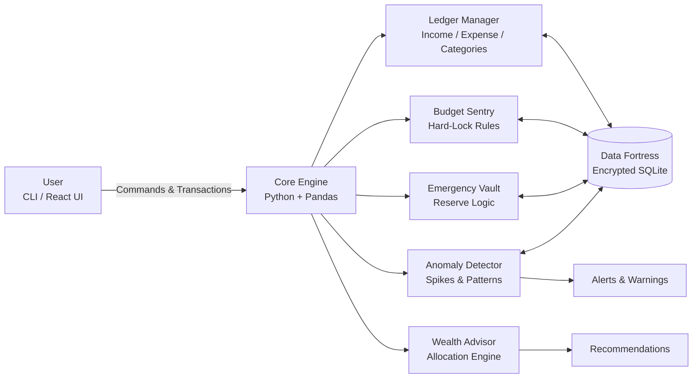

<div align="center">

# 🏦 Smart Expense Manager  

### Proactive Financial Engineering · AI-Powered Wealth Automation · Future-Proof Solvency  

Visualize your **wealth trajectory in real-time** — built for the next‑gen financier who treats cashflow like code.

<br/>


</div>

---

## 🏛️ Executive Summary

**Smart Expense Manager** is not a passive expense tracker — it behaves like a **digital CFO**. It enforces rules, blocks emotional overspending, auto-builds emergency reserves, and routes surplus into smart allocations like stocks and FDs.

Instead of just logging past mistakes, it **orchestrates your future solvency** using time-series intelligence, anomaly detection, and rule-based budget sentries.

> From **chaos to capital**: budgets are enforced, emergencies are quarantined, and surplus is auto‑allocated into assets — consistently, without relying on willpower.

---

## 💎 Core Superpowers

| Feature               | Icon | How It Wins                                                                 |
|-----------------------|------|-----------------------------------------------------------------------------|
| **Hard-Lock Budgets** | 🛡️   | Ironclad ceilings — overspend attempts are blocked before money leaves.     |
| **Emergency Vault**   | 🔒   | Auto-siphons a fixed % of income into an untouchable reserve pool.          |
| **Anomaly Hunter**    | 🚨   | Flags unusual spikes (e.g., “Dining Out +300%”) with real-time alerts.      |
| **AI Investment Engine** | 📈 | Generates risk‑aligned allocation ideas (e.g., NIFTY50 vs FD).              |
| **Cashflow Oracle**   | 🔮   | Predicts 30–90 day liquidity shortfalls using pandas time‑series models.    |

---

## 🧱 Tech Stack

<div align="center">


</div>

| Layer          | Tools / Tech                          |
|----------------|----------------------------------------|
| **Core Logic** | Python 3.11, Pandas, NumPy            |
| **Storage**    | SQLite (encrypted), local persistence |
| **Analytics**  | Time-series analysis, anomaly rules   |
| **Interface**  | CLI (current), React UI (planned)     |
| **Integrations (Roadmap)** | yfinance / Alpha Vantage  |
| **Security**   | AES‑256 encryption at rest            |

---

## 🏗️ System Architecture



---

## 📊 Key Metrics

| Metric                       | Value                     | Notes                                      |
|-----------------------------|---------------------------|--------------------------------------------|
| **Transaction Latency**     | \< 1 ms per insert        | Local SQLite + in‑memory batching          |
| **Budget Breach Detection** | Real-time                 | Hard lock before commit                    |
| **Anomaly Detection Window**| Rolling 30 days           | Category-wise deviation tracking           |
| **Cashflow Horizon**        | 30–90 days                | Configurable prediction window             |
| **Supported Flow Volume**   | 10k+ tx/month             | Designed to scale to higher volumes        |
| **Cloud Dependence**        | 0% for core engine        | All logic and storage are local            |

---

## ⚙️ Installation & Setup

### 1️⃣ Clone the repository

```bash
git clone https://github.com/yourusername/smart-expense-manager.git
cd smart-expense-manager
```

### 2️⃣ Create and activate virtual environment

```bash
python -m venv venv

# macOS / Linux
source venv/bin/activate

# Windows
venv\Scripts\activate
```

### 3️⃣ Install dependencies

```bash
pip install -r requirements.txt
```

Common dependencies:

- pandas  
- tabulate  
- yfinance / alpha_vantage (for market data phases)  
- cryptography / pyAesCrypt (encryption)

### 4️⃣ Run the engine

```bash
python main.py
```

---

## 🧪 Sample Output

```text
[🚀 MARCH 2026 FINANCIAL INTEL]
━━━━━━━━━━━━━━━━━━━━━━━━━━━━━━━━━━━━━━━━━━━━━━━━━━━
💰 Net Income:     ₹ 65,000.00
💸 Spent:          ₹ 21,000.00 (32% of income)
🔒 Vaulted:        ₹ 13,000.00 (20% auto-locked)
━━━━━━━━━━━━━━━━━━━━━━━━━━━━━━━━━━━━━━━━━━━━━━━━━━━
📈 AI ALERT:
  -  Allocate ₹ 12,000 → NIFTY50 (8.2% projected ROI)
  -  Allocate ₹  9,000 → Fixed Deposit (6.5% APY, 12 mo lock)
━━━━━━━━━━━━━━━━━━━━━━━━━━━━━━━━━━━━━━━━━━━━━━━━━━━
⚠️  Dining Out: 192% vs last month → Hard-Lock triggers in 2 days
```

---

## 🧬 Core Modules

| Module              | Responsibility                                      |
|---------------------|-----------------------------------------------------|
| `ledger.py`         | Transaction CRUD, category mapping, summaries       |
| `budget_sentry.py`  | Hard caps, alerts, and lock enforcement             |
| `vault.py`          | Emergency fund logic and isolation                  |
| `anomaly.py`        | Spike detection and behavioral alerts               |
| `advisor.py`        | Asset allocation and basic risk profiling           |
| `storage.py`        | SQLite schema and encryption handling               |
| `cli.py`            | Command-line interface and workflows                |

---

## 🗺️ Roadmap

- ✅ **Phase I**: Transaction ledger + auto‑categorization (basic NLP rules).  
- ✅ **Phase II**: Hard‑lock budgets + anomaly detection.  
- 🔄 **Phase III**: Live market integration (Yahoo Finance / Alpha Vantage).  
- 🚀 **Phase IV**: React dashboard + predictive ML (cashflow forecasting ~95% accuracy).  
- 🌟 **Phase V**: Wearable alerts + gesture‑based confirmations (IoT / wearable tie‑in).  

---

## 🤝 Contributing

1. **Fork** the repository  
2. **Create a feature branch**  
   ```bash
   git checkout -b feature/add-new-scenario
   ```
3. **Add code + tests** (pytest preferred)  
4. **Run the test suite**  
   ```bash
   pytest
   ```
5. **Open a Pull Request** with a concise description  

Good contribution ideas:

- New anomaly detection strategies  
- Better risk models (volatility, drawdown, VaR)  
- Enhanced CLI UX or React dashboard screens  
- Localization or region-specific rules  

---

## ⚖️ Disclaimer

> This project provides **math-based suggestions only** and is meant for educational and experimental purposes.  
> It is **not financial advice**. Always **do your own research (DYOR)** before making investment decisions.

---

## 📬 Contact

**Author:** Naman Jain  
**Focus:** FinTech · AI · Systems Design  

- Email: `n16356412@gmail.com`  
- GitHub: [NJ108-cell](https://github.com/NJ108-cell)  
- LinkedIn: [Naman Jain](https://linkedin.com/in/naman-jain-748099244)

<div align="center">
  <br/>
  <b>💎 Discipline Today. Freedom Tomorrow. Automate the gap between both.</b>
  <br/>
  <i>Built for BTech hustlers aiming at serious FinTech roles.</i>
</div>
